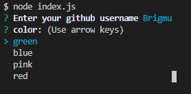
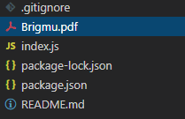

# Developer-Profile-Generator
An application that when give a username generates a pdf resume of the info of the user from github

# Description
This project was created to allow a user to use the node cli to enter a github username and then select a color from a list of provided colors and generate a pdf based on the input provided. The information gathered is used to create an html file that is then converted to a pdf using electron.  As seen in this image:

 

the files dont contain a pdf until the program is run.
Once the program is started using node, inquirer will prompt the user in the command line for information like this: 

.

The pdf file is then written to the files as seen here:

.

And the pdf is generated to look like this:

.

# Installation
To run this program you will need to have node installed, and then run node package manager in the cli to install the required packages.

# Usage
To use this application, simply have all the required installations, then type node index.js into the cli. Then respond to the prompted input.

# Credits
Git - used for all version and used to create the respository
VS Code - used to create the application
Node.js - used to manage packages and to run the program.
